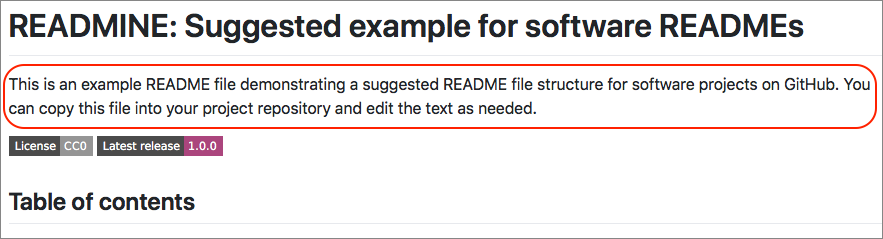

READMINE: Suggested template for software READMEs
=================================================

This is an example README file demonstrating a suggested README file structure for software projects on GitHub.  You can copy this file into your project repository and edit the text as needed.

[](https://creativecommons.org/publicdomain/zero/1.0/)
[](http://shields.io)
[](https://data.caltech.edu/records/1253)


Table of contents
-----------------

* [Introduction](#introduction)
* [Installation](#installation)
* [Usage](#usage)
* [Known issues and limitations](#known-issues-and-limitations)
* [Getting help](#getting-help)
* [Contributing](#contributing)
* [License](#license)
* [Authors and history](#authors-and-history)
* [Acknowledgments](#authors-and-acknowledgments)


Introduction
------------

This single-file repository consists of a README file in Markdown format, and is meant to provide a template for README files as well an illustration of what the README file can be expected to look like.  The structure of this file is based on examining many examples and recommendations for README files, as well as this author's own experiences of creating many open-source projects and repositories over three decades.

The [Introduction](#introduction) section &ndash; which you are presently reading &ndash; should provide background for your software project, a brief explanation of what the project is about, and optionally, pointers to resources that can help orient readers.  (Some README recommendations go straight to installation instructions as the first section, but in my opinion, introductions are important for readers who are not familiar with your technical area.)  Ideally, this section should be short.


Installation
------------

Begin this section by mentioning any prerequisites that may be important for users to have before they can use your software.  Examples include hardware and operating system requirements.

Next, provide step-by-step instructions for installing the software, preferably with command examples that can be copy-pasted by readers into their software environments. For example:

```bash
a command-line command here
```

Sometimes, subsections may be needed for different operating systems or particularly complicated installations.
 

Usage
-----

This section explains the principles behind this README file.  If this repository were for actual _software_, this [Usage](#usage) section would explain more about how to run the software, what kind of output or behavior to expect, and so on.

### Basic operation

A suggested approach for using this example README file is as follows:

1. Copy the [source file](README.md) for this file to your repository and commit it to your version control system
2. Delete all the body text but keep the section headings
3. Write your README content
4. Commit the new text to your version control system
5. Update your README file as your software evolves

The first paragraph in the README file (under the title at the very top) should summarize your software in a concise fashion, preferably using no more than one or two sentences.

<p align="center"></p>

The space under the first paragraph and _before_ the [Table of Contents](#table-of-contents) is a good location for optional [badges](https://github.com/badges/shields), which are small visual tokens commonly used on GitHub repositories to communicate project status, dependencies, versions, DOIs, and other information.  The particular badges and colors you use depend on your project and personal tastes.

The [Introduction](#introduction) and [Usage](#usage) sections are described above.

In the [Known issues and limitations](#known-issues) section, summarize any notable issues and/or limitations of your software.  The [Getting help](#getting-help) section should inform readers of how they can contact you, or at least, how they can report problems they may encounter.  The [Contributing](#contributing) section is optional; if your repository is for a project that accepts open-source contributions, then this section is where you can explain to readers how they can go about making contributions.

The [License](#license) section should state any copyright asserted on the project materials as well as the terms of use of the software, files and other materials found in the project repository.  Finally, the [Authors and Acknowledgments](#authors-and-acknowledgments) section should inform readers who the authors are; it is also a place where you can acknowledge other contributions to the work and the use of other people's software or tools.

### Additional options

Some projects need to communicate additional information to users and can benefit from additional sections in the README file.  It's difficult to give specific instructions &ndash; a lot depends on your software, your intended audience, etc.  Use your judgement and ask for feedback from users or colleagues to help figure out what else is worth explaining.


Known issues and limitations
----------------------------

In this section, summarize any notable issues and/or limitations of your software.  If none are known yet, this section can be omitted (and don't forget to remove the corresponding entry in the [Table of Contents](#table-of-contents) too); alternatively, you can leave this section in and write something along the lines of "none are known at this time".


Getting help
------------

Inform readers of how they can contact you, or at least how they can report problems they may encounter.  This may simply be a request to use the issue tracker on your repository, but many projects have associated chat or mailing lists, and this section is a good place to mention those.


Contributing
------------

Mention how people can offer contributions, and point them to your guidelines for contributing.


License
-------

This README file is distributed under the terms of the [Creative Commons 1.0 Universal license (CC0)](https://creativecommons.org/publicdomain/zero/1.0/).  The license applies to this file and other files in the [GitHub repository](http://github.com/mhucka/readmine) hosting this file. This does _not_ mean that you, as a user of this README file in your software project, must also use CC0 license!  You may use any license for your work that you see fit.


Authors and history
---------------------------

In this section, list the authors and contributors to your software project.  (The original author of this file is [Mike Hucka](http://www.cds.caltech.edu/~mhucka/).)  Adding additional notes here about the history of the project can make it more interesting and compelling.


Acknowledgments
---------------

If your work was funded by any organization or institution, acknowledge their support here.  In addition, if your work relies on other software libraries, or was inspired by looking at other work, it is appropriate to acknowledge this intellectual debt too.  For example, in the process of developing this file, I used not only my own ideas and experiences &ndash; I read many (sometimes contradictory) recommendations for README files and examined real READMEs in actual use, and tried to distill the best ideas into the result you see here.  Sources included the following:

* http://tom.preston-werner.com/2010/08/23/readme-driven-development.html
* https://changelog.com/posts/top-ten-reasons-why-i-wont-use-your-open-source-project
* https://thoughtbot.com/blog/how-to-write-a-great-readme
* http://jonathanpeelle.net/making-a-readme-file
* https://github.com/noffle/art-of-readme
* https://github.com/noffle/common-readme
* https://github.com/RichardLitt/standard-readme
* https://github.com/jehna/readme-best-practices
* https://gist.github.com/PurpleBooth/109311bb0361f32d87a2
* https://github.com/matiassingers/awesome-readme
* https://github.com/cfpb/open-source-project-template
* https://github.com/davidbgk/open-source-template/
* https://www.makeareadme.com
* https://github.com/lappleapple/feedmereadmes
* https://github.com/badges/shields
